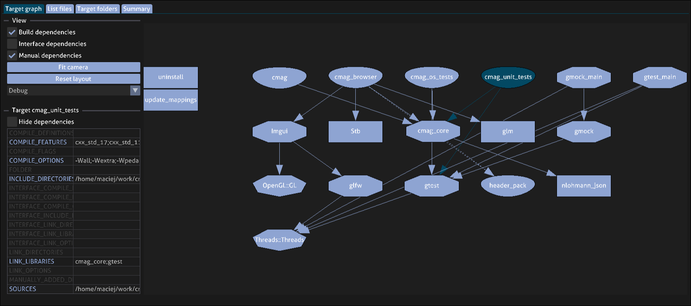

# cmag

Project *cmag* is an interactive browser for the *CMake* build system. It analyzes a *CMake* project, extracts information about it into a custom *.cmag-project* file and then displays it in a GUI application. It doesn't require any integration - any project can be viewed in *cmag*, although projects using very niche CMake features may still experience problems. Currently supported systems are Windows and Linux.


# Usage
The tool is composed of two separate binaries. Command `cmag`, known as the dumper, analyzes a *CMake* project and creates a *.cmag-project* file containing project metadata. Command `cmag_browser` is the GUI component, which reads and visualizes *.cmag-project* files.

To dump a *cmag-project* file, simply prepend `cmag` to your regular *CMake* invocation. For example, if you normally run:
```
cmake .. -DCMAKE_BUILD_TYPE=Release
```

run the following command instead:
```
cmag cmake -DCMAKE_BUILD_TYPE=Release
```

This command runs your *CMake* invocation under the hood, while extracting information about your build system to generate a *.cmag-project* file. If the command is successful, you can open the project file in `cmag_browser` by running command below. The name of resulting project file may be different, depending on *CMake* project name. It will be printed to console.
```
cmag_browser project.cmag-project
```

Alternatively, you can pass a `-g` argument to `cmag` command to dump the project file and open it in the browser immediately. Arguments to `cmag` should go before the `cmake` command. For detailed information about available command-line options, please refer to [cmag_cli](doc/cmag_cli.txt) and [cmag_browser_cli](doc/cmag_browser_cli.txt).
```
cmag -g cmake -DCMAKE_BUILD_TYPE=Release
```


# Browser
An example screenshot of `cmag` analysis performed on `cmag` project itself. Main view is an interactive graph visualizing the connections between *CMake* targets. You can control, which connection types you want to be visible and move the nodes around for better logical understanding of the build-system. You can also select targets and inspect their properties.



# Installation
## Windows
Binaries are available for download as assets attached to [releases](https://github.com/DziubanMaciej/cmag/releases). Cmag is also hosted on [Chocolatey](https://community.chocolatey.org/packages/cmag). To install run the following command:
```
choco install cmag
```

## Ubuntu 20.04, 22.04
Cmag is hosted on [Launchpad](https://launchpad.net/~mdziuban/+archive/ubuntu/cmag). To install run the following commands:
```
sudo add-apt-repository ppa:mdziuban/cmag
sudo apt update
sudo apt install cmag
```

## Arch Linux
Cmag has a source package in [AUR](https://aur.archlinux.org/packages/cmag). To install run the following commands (may be different depending on your AUR helper):
```
yay -Syu cmag
```

## Other Linux distros
Currently, no support. Cmag has to be built from source.


# Building from source
Compilation requirements: `git`, `cmake` (minimum 3.15.0) and a C++ compiler (C++17 required). Clone the repository and run the commands below. Note that the `install` command must be run with administrative privileges. To install to a custom location without administrative privileges, pass `-DCMAKE_INSTALL_PREFIX=<path>` to the first `cmake` command.
```
git submodule update --init --recursive
mkdir build
cd build
cmake ..
cmake --build .
cmake --install .
```
